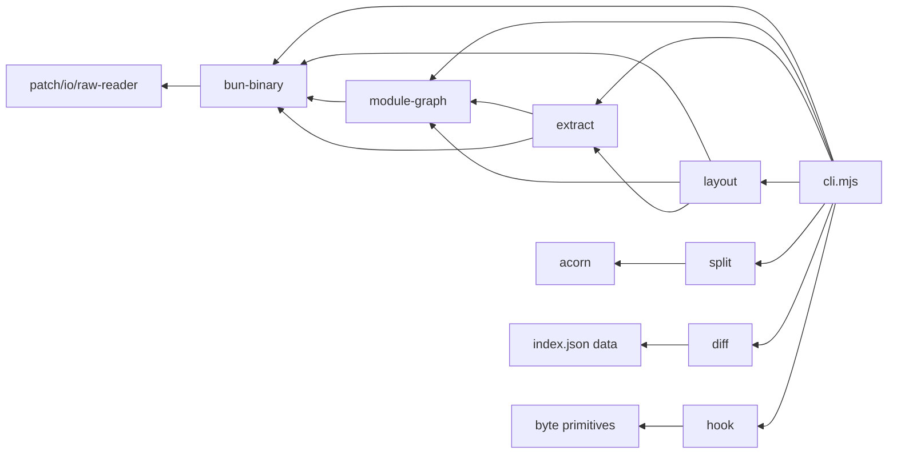
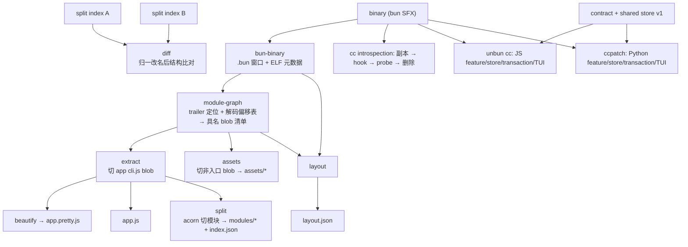

# unbun — ARCHITECTURE（当前架构视图）

> 本文回答**当前是什么 / 在哪里**（骨架视图：lib 分层、数据流、seam、关键机制）。做什么 / 为什么见 [`spec.md`](spec.md)；二进制格式字节级事实见 [`FINDINGS-phase0.md`](FINDINGS-phase0.md)。
> 状态：通用 Bun SFX 工具与 Claude Code 双实现补丁管理器均已实现。当前发布矩阵为 Bun `394 pass`、Python `371 pass`，另有公开 CLI互操作与共同 PTY gate；准确数字以 [`dual-implementation-progress.md`](dual-implementation-progress.md) 最近一次发布记录为准。E1–E8、A9 与 P4 按需 reader 已反映；剩余事项见 [`deferred-backlog.md`](deferred-backlog.md)。

## 顶层系统边界

独立仓库包含三个并列子系统：

1. **通用 Bun SFX 静态分析**：`extract`、`assets`、`split`、`layout`、`diff`、`rebuild`，依赖 ELF 与 Bun `StandaloneModuleGraph`。
2. **Claude Code 只读运行时内省**：`cc run`、`cc introspect`、`cc patch-loader-hook`，只修改并运行临时副本。
3. **Claude Code 双实现补丁管理器**：JavaScript/Bun `unbun cc` 与 Python `ccpatch`，各自完整实现 feature、probe、exact replay、shared store、transaction、CLI 与 TUI；两者不调用对方核心。

补丁器共同消费仓库中的 `contract/`：schemas、error catalog、feature/store/lineage vectors 与 frozen golden。磁盘互操作边界是 shared store v1，而不是源代码复用。

| 层 | JavaScript/Bun | Python | 共同边界 |
|---|---|---|---|
| Feature / probe | `lib/patch/core/`、`lib/patch/targets/claude/` | `python/cc-patch/src/cc_patch/features/`、`probe.py` | `claude-v1` states、sites、substates、依赖图 |
| Store / lineage | `lib/patch/store/` | `store.py`、`lineage.py`、`locking.py`、`snapshots.py` | [`shared-store-format.md`](shared-store-format.md) |
| Transaction | `lib/patch/transaction/` | `orchestrate.py`、`atomicio.py` | baseline-before-binary、exact replay、error codes |
| CLI | `lib/patch/cli/`，入口 `unbun cc` | `cli.py`，入口 `ccpatch` | JSON schemas、exit severity |
| TUI | Ink + React | Textual | final target set、共同 PTY scenarios |

`agent-model` 无依赖；`channels` 依赖 `source-exec`。TUI只提交 dependency-closed final target set与entry digest，不能自行逐 feature写盘或管理baseline。`lib/patch/` 的内部层次与双实现对应关系见 [`dual-implementation-spec.md` §4](dual-implementation-spec.md#4-两套实现的边界与镜像关系)。

## 通用 SFX 分层：共享 `lib/` 解析层 + 单一 CLI 分发

Bun 运行时。`cli.mjs` 分发通用命令与 `cc` namespace；通用命令消费共享 `lib/` 解析原语。纯静态命令不跑目标二进制；`cc run/introspect/patch-loader-hook` 只对副本打桩 + 跑；`cc status/patch/revert/snapshot/store/lock` 进入新的 `lib/patch/` production路径。

| 模块 | 职责 | 依赖 |
|---|---|---|
| `lib/bun-binary.mjs` | 纯 ELF 层：`readBinary(path)` → **BinaryReader**（统一 reader 接口：`.slice(off,len)` / `.u16/u32/u64(o)` / `.toString(enc,s,e)` / `.lastIndexOf(needle,from,to)` / `.sections` / `.elf` / `.close()`），对 Bun 格式**零知识**。**mmap 主 + pread 回落**：优先 `Bun.mmap` 惰性映射整文件（零拷贝 Buffer 视图、按需分页），映射运行中的可执行文件失败（ETXTBSY，活 claude 正被执行）时回落 pread（openSync 定点读）；两后端同接口、下游零改动。**on-demand**：不再全量常驻，只读/映射真正要的字节（元数据尾窗 + blob 内容），常驻 ~86MB（vs 原始全读 293MB；mmap 与 pread 内存持平，mmap 优势在代码更简）。入口校验 ELF magic + `ELFCLASS64`（非 ELF / ELF32 尽早 fail-loud）、section 名扫描有 strtab 越界守卫、pread 越界硬 throw、close 后再用抛 used-after-close。`defaultBinary()` 定位 live claude | `patch/io/raw-reader` |
| `lib/module-graph.mjs` | 定位 `.bun` 内真 trailer + 解码 `StandaloneModuleGraph` → blob 清单。`parseModuleGraph(bin, preRead?)` 收可选 `preRead`（上游 `readBinary` 已得的 **BinaryReader**）透传复用、免重复 mmap/pread。**Bun 格式知识的唯一定居点** | bun-binary |
| `lib/extract.mjs` | 选入口 blob（权威 `isEntry` 指认 + 回落）→ app 源；best-effort version 解析。`versionFromBlobs(reader,blobs)` 复用同一 reader + 已解析 blobs 供 assets/layout 解 version（不重开 reader、不重读二进制） | bun-binary, module-graph |
| `lib/naming.mjs` | 4 命令共享的默认 outdir 命名单一真相源：`outdirName(bin,version)` → `claude-code-<version‖basename>`；`uniqueAssetName(name,offset,used)` 用 offset tiebreaker 消歧同名 basename（防静默覆盖） | node:path |
| `lib/beautify.mjs` | esbuild `transformSync` AST 重印 → `app.pretty.js` | 本地 esbuild dependency |
| `lib/split.mjs` | acorn 下钻外层 IIFE → 遍历 body 顶层 var-decl → helper 签名动态识别 → 逐模块切片 + helper 集；每模块附内容 `hash`（源字节 sha256 前 16 hex）供 diff 精确身份 | acorn |
| `lib/layout.mjs` | module-graph 精确边界 + ELF section → 五分类体积分账 + 人类可读表 | bun-binary, module-graph, extract（`versionFromBlobs`） |
| `lib/diff.mjs` | 纯数据：两 split index 归一改名后结构 diff（两趟配对，借鉴 git rename detection）。内容指纹优先用每模块 `hash` 做精确身份，任一侧缺 hash 回落 `(kind,bytes)` 近似（向后兼容老 index） | 无（吃 index.json 数据） |
| `lib/hook.mjs` | 纯字节等长 loader-hook 打桩器 + 等长守卫。参数化 anchor/payload | 无 |
| `lib/probes/*.cjs` | 跑在真 Bun 运行时里的只读探针：`dump-assets` / `module-graph` / `runtime-facts`，经 `CC_EXT` 注入 | Bun 运行时 API |

### 静态 import 关系（无环）

箭头表示「左侧模块静态 import 右侧模块」；`split.mjs` 不 import `extract.mjs`，`diff`、`hook` 不依赖这条解析链。

### 命令数据流

`binary → bun-binary → module-graph → extractApp → splitModules` 是二进制输入执行 `split` 时由 `cli.mjs` 编排的命令数据流，而非 `split.mjs → extract.mjs` 的静态 import。`layout` 通过 `versionFromBlobs` 复用 `extract.mjs` 的版本解析；`diff` 独立消费目录 / `index.json` 数据。

### 实现透出比 spec 契约更富（如实记）

spec 的 `parseModuleGraph → {blobs:[{name,offset,length}]}` 是最小契约；实际实现遵循 **richest-context-flow**，多透出下游有用的字段，下游据此免二次解码：

- `parseModuleGraph(bin, preRead?)` → `{ trailerOffset, entryPointId, blobs }`，每个 blob 附 `{ name, offset, length, loader, isEntry }`——`loader`（Bun `Loader` enum 名，js/file/napi…）供 layout/assets 分类，`isEntry`（`i === entryPointId`）供 extract 权威指认入口，免下游重复推断。可选 `preRead`（上游 `readBinary` 已得的 **BinaryReader**）**单读贯穿**：extract/assets/layout/split 各命令一次 `readBinary` 后把 reader 透传给下游，消除同进程对 blob 内容的隐藏双读 / 双映射（E1）。
- `splitModules(app)` 每模块记 `hash`（该模块源字节 `sha256[:16]`）写进 `index.json`——供 `diff` 做精确内容身份（E5），彻底消除「两个不同模块恰好同 `(kind,bytes)` 被误配成 renamed」的假阳性；两侧 index 任一缺 hash 时 `diff` 整体回落旧 `(kind,bytes)` 近似指纹，绝不对老产物崩。
- `computeLayout(bin)` → `{ fileSize, engine, entryPointId, sections, blobs, breakdown }`——透出完整 `sections` 元数据与每 blob 的 `category`（app/native/asset），不预裁剪。

## 数据流

- **静态支线**：`binary → bun-binary → module-graph`（一次定位 + 解码）→ 分叉给 `extract`（入口 blob → app.js → beautify）、`assets`（非入口 blob）、`split`（吃 extract 的 app 源再 acorn 切模块）、`layout`（吃 blob 精确边界 + ELF section 分账）。
- **diff** 独立于二进制，吃两个 split 产物的 `index.json`（纯数据）。
- **cc introspection**：`binary → 临时副本 → hook 等长打桩 → bun spawn（CC_EXT=probe）→ 收集 stdout → 删副本`。对 live binary 全程只读。
- **cc patch manager**：两个公开实现各自 probe 当前 bytes，使用同一 shared store identity 与 baseline，exact replay证明build lineage后原子替换；另一实现可以继续消费同一baseline/snapshot/lock。
- **windowed probe**：`probe_windows`（锚点 census 开小窗）→ 合并读入 → `candidateRanges`（每个已发现站点 ±8,000）→ `candidatesComplete`（候选必须完整落在已读窗内，否则 fail-closed 回落 full detect）→ `detect_windows`。整读 268MB 的 `toString('latin1')` 每次约 200ms，所以「能不能走窗口化」直接决定 `cc` 的体感速度。两条不变量：**windowed 与 full 的 `state`/`sites`/substates（含 identity）必须逐项相等**；带跨窗语义的 feature（channels）必须先跨窗合并原始站点、再一次性定序号与 absent 占位，单窗视角判不出「站点真缺失」还是「站点在别的窗里」。

## seam 说明（bun-binary vs module-graph）

「定位 trailer」与「解码记录」不可干净切成两层——要在多处 `---- Bun! ----` magic 里判定哪个是真 trailer，往往得试着按结构解一下。故 **trailer 定位 + module-graph 解码合并在 `module-graph.mjs` 一层**：`bun-binary.mjs` 只做纯 ELF 层（给 `.bun` 字节窗口 + 各 section 元数据），**不反向依赖解码逻辑**，保住单一事实源不渗漏。Bun 格式知识（`sizeof(Offsets)=32`、52 字节记录、Loader enum、trailer 字面量）全部只定居在 `module-graph.mjs`，下游命令一律消费 `parseModuleGraph` 接口、不再碰原始字节布局；未来 Bun 改布局只需改 `decodeRecords` 实现体。

## 关键机制点睛

- **module-graph 解码 + fail-loud 自证**：`.bun` 窗口内 `lastIndexOf(magic)` 取真 trailer（排除 `.rodata` 引擎区 HMR 常量副本）→ trailer 前 32 字节 `Offsets` 头（`byte_count` / `modules_ptr` / `entry_point_id`）→ `graph_base = offsets_start - byte_count`（权威推导，不靠 `.bun+8` 巧合）→ `N = modules_ptr.length / 52` 条 52 字节记录，每条读 `name` + `contents` 两个 StringPointer + `byte[49]` loader。解码后**自证**：每个 blob 名必须可打印且含 `$bunfs`；contents 头 64 字节须命中 `HEAD_MARKERS` 白名单；按 offset 排序相邻 blob 无重叠、末 blob 贴到记录数组起点。白名单含通用 `// @bun`（bun `--compile` 对 ESM 入口的通用 bundle banner）**与** claude 预打包 CJS 的 `@bun-cjs`，使解码对任意 bun SFX 通用。自证失败即显式 `throw`，绝不静默产坏切片。
- **helper 动态识别（顶层作用域 + arity，非硬编码名）**：minifier 分配的 helper 名跨版本必漂（实测 esm=`b`/cjs=`K`@205、esm=`E`/cjs=`J`@201——见 FINDINGS-phase0.md）。naive「arrow 返回 arrow」签名会误捞模块**体内**的 memoizer lookalike（205 有 6 个高频）。真正把真族与 lookalike 分开的是**外层 IIFE 顶层作用域**：真 helper 只在外层 body 顶层以 `var X=name(cb)` 出现，lookalike 从不——故只扫外层顶层 var-decl 就天然排除全部 lookalike。候选再按 callback arity 二分：零参 thunk `()=>…`→esm、含参 `(exports[,module])=>…`→cjs。唯一保留的相对安全网是「顶层出现 >1 次」排一次性 stray，不设绝对频率下限（服务任意规模 SFX）。
- **等长 loader-hook（TOC-safe）**：claude bundle 顶部有一行 77 字节纯注释锚（`// Claude Code is a Beta product …`）。把它**等长**覆盖成可执行 payload + 空格填充、行尾 `\n` 原位保留 → 文件 size 分毫不变 → Bun 尾部 TOC 偏移全不动 → 无需改 TOC，payload 在模块顶层、main 之前执行。payload 超锚点即拒（前置守卫）；每处校验其后紧跟 `\n`；打全部命中 site。
- **子集 oracle（`embeddedFiles ⊆ static assets`）**：`Bun.embeddedFiles` 只含 `with {type:"file"}` 的嵌入件（2 个 `.node`），而静态 module-graph 还含 `cli.js` 本体、辅助 js、mermaid。故正确交叉验证是**真包含**而非 `===`（写 `===` 会误杀正确的静态解析器）。此 oracle 只验资产解码这一子集。
- **round-trip oracle（extract→rebuild→run 无损）**：`rebuild` 用 `bun build --compile` 反向重打包 app.js；跑得起来 ⇒ app bundle 切对了（offset/length 都对）。这兜住 module-graph 长度 oracle 覆盖不到的缺口（中段非 JS/非 ELF blob 的 length 不足、blob 漏解）。纯 app.js round-trip 是契约内；连带外部 `.node` 原生依赖的 round-trip 属 gitignored smoke。
- **CPU/IO 真并行提速（extract / split，fail-loud 不吞）**：`extract` 把 `strings`（外部子进程、~1.9s IO）用 `spawn` **在 beautify 之前**启动，让 OS 在 beautify 阻塞事件循环（~3s 同步 CPU）期间照样调度它 → 净耗 ≈ max(两者) 而非串行相加（E7）；`split` 6000+ 模块写盘从逐个同步 `writeFileSync` 改 `fs.promises.writeFile` + `Promise.all` 分批（每批 512，防撞 fd 上限 EMFILE）并发写（E6）。二者都令 `runExtract`/`runSplit` 变 async，所有调用点（dispatch / 入口链 / 测试）须 `await`（漏 await = strings 未写完就断言 = 假绿/竞态）；子进程非零退出 / 写失败 → reject 显式传播，绝不吞。

## 安全边界

- **static vs runtime vs mutate 三分**是真正的架构关注点分离：`extract`/`assets`/`split`/`layout`/`diff` 纯读、绝不执行目标；`cc run`/`introspect`/`patch-loader-hook` 只对副本打桩 + 跑；显式 `cc patch/revert/snapshot restore` 与 Python 对应命令才会写目标，并走 shared clean baseline、cooperative lock、exact replay、原子替换、回读后验与失败回滚。**写权限只由显式 mutating 子命令授予**——不带子命令的调用一律走只读路径，与是否带 `--binary`/`--json`/`--feature` 等选项无关（两侧对齐）。裸非TTY调用只读。
- **fail-closed 平台写 gate**：仅 `production_write_gate.status === 'enabled'` 的平台（当前只有 Linux）允许 production 写；否则以 `platform_write_disabled`（exit 1）拒绝且目标字节不变。两实现都在**取 target lock、建 baseline、写盘之前**强制它，保护范围是目标二进制的两个 mutating 入口（patch/revert transaction 与 snapshot restore），store-only 操作不在其列。gate 数据驱动于 `contract/vectors/platform-writes-v1.json`（Python 侧另随 wheel 发布同一份副本，有逐字节防漂移测试锁住）。
- **目标寻址用 canonical 路径**：写入对象与 store 身份键（`path_key`）同源于 realpath，避免 symlink 安装布局下「patch 打在 symlink 上、真实二进制未动」以及 pathKey 漂移导致 baseline 不可达（后者会让不可逆的 channels 永久无法回退）。
- **无 shell 拼接**：`strings`（extract）、`bun build`（rebuild）、spawn 副本（cc）全走 `execFileSync`/`spawnSync` 数组参数，路径含 `$(...)` / 反引号 / `$VAR` 也不被求值。
- **目标二进制是不可信解析输入**：由其内容解析出的 version 等字段在参与路径构造前经严格校验与净化，并校验最终产物仍位于 `refs/` 根内。
- **错误不被吞掉**：lock 释放失败不覆盖主体错误（降级为 `releaseError` 诊断）；扩展/probe 加载或落盘失败 fail-loud 而非静默成功；平台 gate 拒绝以稳定 code 原样传播，不被重映射。
- **行为修改入口明确**：loader-hook只承载只读探针；功能补丁由 `unbun cc` 或 `ccpatch` 各自production transaction执行，两者以共享磁盘协议互操作，不共享核心代码。
</content>
