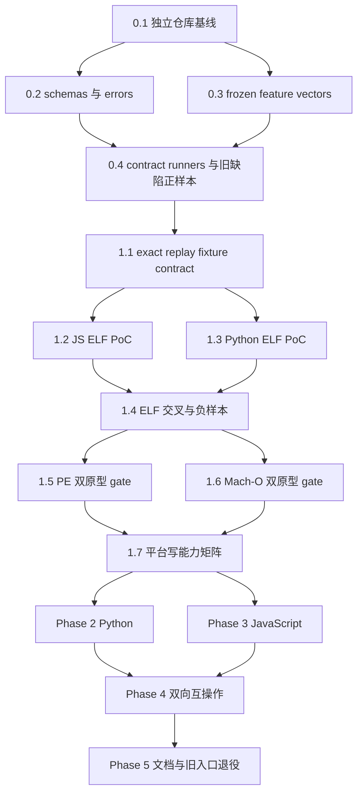

# unbun Claude Code 补丁器双实现实施计划

> 状态：已完成并归档。Phase 0–5 的实施记录见 [`dual-implementation-progress.md`](dual-implementation-progress.md)，验收结果见 [`dual-implementation-acceptance.md`](dual-implementation-acceptance.md)。
>
> 日期：2026-07-23。
>
> 权威规格：[`dual-implementation-spec.md`](dual-implementation-spec.md) 与 [`shared-store-format.md`](shared-store-format.md)。如本计划与规格冲突，以规格为准并停止修改 contract；不得用实现现状反向覆盖规格。

## 1. 目标与完成边界

本计划把现有 JavaScript 一代补丁器与成熟 Python 补丁器重构为 `unbun` 独立仓库内两套长期维护、功能完整、互不调用核心代码的实现。两套实现共享行为 contract、store v1、frozen vectors 与互操作测试，但分别拥有 feature、probe、lineage、store、transaction、CLI、JSON 与全功能 TUI。

完成必须同时满足以下条件：

- `unbun cc` 与 `ccpatch` 均可独立完成 status、patch、feature revert、revert all、snapshot save/list/rm/restore、lock 诊断与 stale lock 显式清理。
- JavaScript 与 Python 不通过 RPC、FFI、subprocess、源码 import 或动态加载复用对方的 feature、store、lineage 或 transaction 核心。
- 两边独立读取相同 vectors，产生相同状态、sites、依赖闭包、最终字节、manifest 语义、错误 code 与退出码。
- 任一实现写入 baseline、snapshot 或 lock 后，另一实现能直接消费并继续操作。
- 两套全功能 TUI 均保留，并通过真实 PTY 屏幕与状态转移测试。
- 所有写路径测试仅操作合成 fixture 或测试自行创建的临时副本。当前 live `2.1.217` 已三 feature patched 且无 baseline，只允许只读 probe，绝不参与 baseline 建立、lineage 成功、patch、revert、snapshot restore 或运行时写路径验收。
- 发布闸门使用显式提供的 clean fixture 或安装后复制出的 clean binary，不能假设存在 clean `2.1.217`，也不能用其他版本伪装成 `2.1.217` baseline。

本计划不增加 durable journal、服务化状态机、跨平台 atomic exchange、旧 backup 兼容、企业权限治理或其他规格外安全扩展。

## 2. 已知现状与迁移原则

### 2.1 当前基线

- `unbun` 已从旧仓库抽出并执行 `git init`，但尚无 commit；根 `.gitignore` 已创建。
- `bun test` 当前为 `109 pass / 0 fail`。Phase 0 必须先复跑并记录该基线。
- Python 源位于 `/home/xp/.claude/scripts/cc-patch`，当前 `uv run pytest -q` 可收集 276 个测试。迁入前必须运行全套并记录通过数，不能仅依赖 collect 结果。
- 旧 `.ccbak`、`.agentbak` 与 `.channels.bak` 已删除。新 store 从空目录开始，不做 discovery 或 migration。
- 当前 JS 一代入口在 `cli.mjs`，核心在 `lib/patch-binary.mjs`、`lib/patch-agent-model.mjs`、`lib/patch-channels.mjs` 与 `lib/patch-tui.mjs`。
- 当前 Python 已具备三 feature、目标集合重放、快照、原子替换、codesign、JSON、Textual TUI 与 PTY 测试，但 store 使用旧扁平 backup 命名，并仍 import `migrate`。

### 2.2 必须保留为缺陷正样本的 JS 一代行为

以下行为不能在重构时直接删除测试痕迹，必须先转成能够击败旧实现的正样本：

1. `agent-model` 将 minifier receiver 硬编码为 `E`，对 `S`、`A` 或其他 audited receiver 失败。
2. 旧 contract 把 `agent-model` 错误声明为依赖 `source-exec`；决定性运行时 PoC 已证明 agent-only patch 保留 `@bytecode` 时生效，新 registry 必须移除该依赖，同时保留 `channels -> source-exec` 与独立 `source-exec` feature。
3. `channels` revert 从相邻 `.bak` 整文件恢复，会抹掉后来叠加的其他 feature。
4. baseline 使用目标旁的 `.bak`，会进入 launcher 扫描风险区，也不符合 shared store identity。
5. CLI 把多类拒绝与一致性失败压成错误退出码 `1`，不能满足稳定 code 与严重度规则。

这些测试必须先证明在旧路径上会失败或观察到错误行为，再用于新路径验收。禁止把旧实现自己的 round-trip 当作充分 oracle。

### 2.3 TDD 与提交纪律

每个任务严格执行：

1. 写最小失败测试或失败 conformance check。
2. 运行任务列出的窄命令，确认失败原因就是目标缺口。
3. 实现最小完整行为。
4. 重跑同一窄命令至通过。
5. 运行该阶段的累计闸门。
6. 在进度 ledger 记录该语义单元的文件清单、验证命令和结果。只有用户明确授权时才创建 Conventional Commit。

仓库尚无首个 commit，当前实施不把 commit 作为阶段闸门。每个 Task 开始前先在 `docs/dual-implementation-progress.md` 记录待改文件和当前验证基线，所有人工编辑使用小步 `apply_patch`，失败时只逆向本 Task 的明确变更；不得用 `git reset --hard`、`git clean`、覆盖未确认的工作树更改或复制整棵源码形成隐蔽备份。只有用户明确授权 commit 后，才把已验证 Task 整理成 Conventional Commit。涉及共享 store 的测试必须设置 `UNBUN_CC_STORE` 指向测试临时目录。

## 3. 目标目录与内部接口

计划采用规格建议的边界，具体文件可在不改变合同的前提下做同目录内小幅调整：

```text
contract/
  schemas/
  vectors/
    feature-claude-v1/
    store-v1/
    lineage-v1/
    known-bad-v1/
  golden/
  README.md
exp/exact-replay/
  js/
  python/
  fixtures/
lib/patch/
  core/
  io/
  store/
  transaction/
  targets/claude/
  tui/
python/cc-patch/
  pyproject.toml
  src/cc_patch/
  tests/
test/contract/
test/interop/
test/pty/
```

两套实现可以使用不同内部类型，但必须分别提供以下等价能力：

```text
RawReader:
  size
  slice(offset, length)
  toString(encoding, start, end)
  lastIndexOf(pattern, start, end)
  close()

Feature:
  detect(full_bytes)
  probe_windows(reader)
  detect_windows(windows)
  observe_substates(bytes)
  replay_substates(clean_bytes, vector)
  apply(mutable_bytes)
  reverse(mutable_bytes)  # 仅 reversible feature

Store:
  resolve_root()
  identify_target(path)
  acquire_lock(target, command)
  read_or_create_baseline(...)
  list/save/remove/read_snapshot(...)
  quarantine(...)

Transaction:
  probe(path)
  write_target_set(path, target_features, entry_digest?)
  restore_snapshot(path, slug, version?, confirmed?)
```

CLI 与 TUI 只能提交“最终目标 feature 集合”，不能直接操作 baseline blob、逐 feature 写盘或自行 codesign。

## 4. 阶段依赖与并行策略



- Phase 0 的 schema 与 frozen feature vector 可在首个基线 commit 后并行，二者都完成后再写 contract runners。
- Phase 1 的 JS 与 Python PoC 必须由不同源码独立实现，可并行；交叉 harness 只把它们当黑盒进程比较结果。
- Phase 2 与 Phase 3 在 Phase 1 contract 冻结后可并行。两边不得在实施分支中各自修改 frozen contract；发现合同缺口时先提交共同 contract 变更及双边失败向量，再继续实现。
- Phase 4 必须等待两套公开 CLI、store、transaction 与 TUI 均完成。
- Phase 5 必须等待 Phase 4 全矩阵通过，旧源码删除与旧入口退役必须串行执行。
- 同一阶段内，纯 feature core 可并行于 store parser；transaction 必须等待 feature replay、lineage 与 store 激活协议完成；CLI/TUI 必须等待 transaction 稳定。

## 5. Phase 0：独立仓库与共同 contract

### Task 0.1：建立独立仓库可复现基线

**依赖：** 无。

**文件：** `.gitignore`、`README.md`、`docs/dual-implementation-spec.md`、`docs/shared-store-format.md`、本计划、kickoff，以及当前所有源码与测试。

**步骤：**

1. 运行 `git status --short --untracked-files=all`，确认仓库无已有 commit，并人工核对 `.gitignore` 覆盖 `node_modules/`、Python `.venv/`、`__pycache__/`、`.pytest_cache/`、测试临时产物、`refs/` 与本机 memory 路径，但不忽略 `contract/golden/`。
2. 运行 `bun test`，要求精确得到 `109 pass / 0 fail`；若数量变化，先记录新增或删除原因，不把变化静默写入基线。
3. 在旧 Python 目录运行 `uv run pytest -q`，要求全套通过并记录实际 pass 数。
4. 在 `README.md` 增加 provenance：来源仓库位置、抽取日期、未伪造旧 Git history、当前 JS/Python 源位置与迁移规格链接。
5. 在 `docs/dual-implementation-progress.md` 记录基线文件清单 hash、测试通过数和忽略规则检查结果；不创建未授权 commit。

**验收闸门：**

```bash
cd /home/xp/src/unbun
git status --short --ignored
bun test
uv run --directory /home/xp/.claude/scripts/cc-patch pytest -q
```

测试全绿，生成物只出现在 ignored 列表中，ledger 中的基线记录与实际命令结果一致。

**风险与回滚：** 首次版本边界可能误收本机产物。用 `git status --short --ignored` 与 `.gitignore` 行为测试阻断；在用户授权首 commit 前，所有文件仍保持可审阅的未跟踪或未提交状态。

### Task 0.2：冻结 JSON schemas、错误目录与共同规范化规则

**依赖：** Task 0.1。

**创建：**

- `contract/schemas/status.schema.json`
- `contract/schemas/write-envelope.schema.json`
- `contract/schemas/error.schema.json`
- `contract/schemas/target.schema.json`
- `contract/schemas/baseline.schema.json`
- `contract/schemas/snapshot.schema.json`
- `contract/schemas/lock-owner.schema.json`
- `contract/schemas/quarantine.schema.json`
- `contract/vectors/error-codes-v1.json`
- `contract/vectors/canonical-path-v1.json`
- `contract/README.md`
- `test/contract/schema.test.mjs`

**测试先行：** 先写 schema loader，要求所有有效示例通过、缺必需字段、错类型、更高 schema version、非法 slug/version、绝对 blob path 与 `..` traversal 坏样本失败。路径 vectors 至少覆盖 POSIX symlink、空格、NFC、Windows drive、UNC、separator、`Ü`、`ß` 与 ASCII-only lowercase。

**接口与数据：** schema 使用固定 `$id` 和 `schema_version: 1`；error vector 固定规格 §12 的 code、exit 与语义。动态字段如绝对临时路径、时间、PID 与 hostname 通过 vector placeholder 归一化，不进入 public golden。

**命令：**

```bash
cd /home/xp/src/unbun
bun test test/contract/schema.test.mjs
```

**验收闸门：** 每个 schema 至少有一个有效样本和四类坏样本；测试不得只 `JSON.parse`，必须实际执行 schema validation。若增加 schema validator，使用包管理器解析当前稳定版本并更新 lockfile，不手写猜测版本。

**风险与回滚：** schema 过度约束未知可选字段会破坏前向兼容。测试必须证明未知字段被接受、未知 schema 或更高 version 被拒绝。

### Task 0.3：冻结 feature、store 与 known-bad vectors

**依赖：** Task 0.1。可与 Task 0.2 并行。

**创建：**

- `contract/vectors/feature-claude-v1/manifest.json`
- `contract/vectors/store-v1/manifest.json`
- `contract/vectors/lineage-v1/manifest.json`
- `contract/vectors/known-bad-v1/manifest.json`
- `contract/golden/README.md`
- `contract/golden/claude-v1/*`
- `test/contract/vector-integrity.test.mjs`

**测试先行：** vector integrity 测试先要求每个文件有固定 SHA-256、size、来源说明、输入状态、预期 substate vector、预期输出 hash、预期 code 与 exit。测试运行期不能调用任一 feature 实现生成 expected。

**最小 corpus：**

- `source-exec`：首尾多 tag、32MB discovery 边界、重叠窗口、clean、patched、mixed、unsupported。
- `agent-model`：receiver 分别为 `E`、`S`、`A` 的 audited exact variants；未知 enum 内容必须 unsupported；多 describe suffix 必须收集全部 sites。
- `channels`：decision clean/patched、尾部无关 register decoy、多个 decoy、essential feature flag 缺失、permissions/cap-strip absent、best-effort clean/patched/mixed。
- 依赖闭包：空集合、各单 feature、双 feature、全 feature、拒绝移除仍被依赖的 `source-exec`。
- known-bad：硬编码 `E`、旧 contract 为 agent-only 请求多打 `source-exec`、channels revert 抹掉 agent-model、相邻 `.bak`、错误 code/exit。
- store：valid manifests、缺字段、错类型、未知高版本、path traversal、hash/size/version/state mismatch、orphan blob、manifest-only、temp-only、lock contention、stale lock unknown owner、snapshot ambiguity、force activation。
- lineage：clean、所有目标集合、可完整 replay 的 mixed、不可完整描述的 mixed、同 path 同 version 不同 build。

初始 golden 由旧 Python golden、已审计历史输出与人工 byte diff 三方冻结。`_generate` 类脚本只能放在 `contract/golden/tools/` 并明确标注非测试 oracle；日常测试不能自动更新 golden。任何 golden 更新必须在 ledger 中单列 hash、人工 diff 与双实现变更理由；只有用户授权时再独立提交。

**命令：**

```bash
cd /home/xp/src/unbun
bun test test/contract/vector-integrity.test.mjs
sha256sum --check contract/golden/SHA256SUMS
```

**验收闸门：** 暂时把旧 JS 一代实现接到 known-bad probe，至少五个正样本能观察到失败，证明 corpus 不是空断言或同源自证。

**风险与回滚：** 从实现自动导出 expected 会制造 false green。任何 golden 更新必须单独 commit，附人工 diff 与双实现变更理由。

### Task 0.4：建立独立 contract runners 与公开 CLI E2E harness

**依赖：** Tasks 0.2、0.3。

**创建：**

- `test/contract/js-vector-runner.mjs`
- `test/contract/python-vector-runner.py`
- `test/interop/cli-harness.mjs`
- `test/interop/normalize-output.mjs`
- `test/interop/README.md`

**测试先行：** runner 初始只读 schema/vector 并输出规范化 JSON；先用故意错 expected 证明 harness 会失败，再恢复。CLI harness 必须使用子进程调用 `bun cli.mjs cc ...` 与未来 `uv run --directory python/cc-patch ccpatch ...`，不能 import 另一实现内部模块。

**接口：** 每个 runner 从 stdin 接收 vector path，stdout 只输出 JSON，stderr 用于诊断。interop normalizer 只归一化时间、临时绝对路径、PID、hostname 与实现标识，不得删除 feature state、sites、hash、code、exit 或 manifest 字段。

**命令：**

```bash
cd /home/xp/src/unbun
bun test test/contract test/interop/cli-harness.test.mjs
```

**验收闸门：** harness 能区分“同实现写读”和“JS 写、Python 读”；在 Phase 0 可以把未迁入的 Python runner 指向只读原型，但正式互操作只能使用仓库内公开入口。

**风险与回滚：** 过度 normalization 会掩盖真实不一致。每个被归一化字段必须在 README 列出理由，并有反测试证明 code/hash/sites 不会被归一化掉。

### Phase 0 出口

- 独立仓库基线文件、hash、忽略边界与测试结果已记录在进度 ledger。
- JS 109 个基线测试与旧 Python 全套测试通过。
- schemas、error catalog、feature/store/lineage vectors 与 frozen golden 已入库。
- known-bad 正样本能击败 JS 一代缺陷。
- interop harness 已能以公开进程边界驱动两个实现，不依赖同源 round-trip。

## 6. Phase 1：exact replay proof 双原型 PoC

### Task 1.1：定义 PoC fixture 与机器可读结果合同

**依赖：** Phase 0。

**创建：**

- `exp/exact-replay/README.md`
- `exp/exact-replay/fixtures/manifest.json`
- `exp/exact-replay/js/replay-proof.mjs`
- `exp/exact-replay/python/replay_proof.py`
- `test/contract/exact-replay-harness.test.mjs`

**fixture 规则：**

- ELF 第一优先，使用测试构建器生成的 Bun SFX 或最小可执行 fixture，原件只读，每次测试复制到临时目录。
- PE 与 Mach-O fixture 必须记录 format、arch、签名状态、生成命令、SHA-256 与授权来源。不能下载不固定内容，也不能引用 live install 路径作为 vector。
- 每个平台至少包含 clean baseline、全部 feature 组合、可 replay mixed、不可 replay mixed、同 version 不同 build。
- Mach-O 另含 original-signed 与基于同一 payload 的 ad-hoc-resigned fixture；签名材料可合成，不要求 Apple 身份证书。

**PoC 输出：**

```json
{
  "implementation": "js",
  "format": "elf",
  "supported": true,
  "normalized_size": 123,
  "baseline_lineage_sha256": "...",
  "expected_sha256": "...",
  "current_sha256": "...",
  "byte_equal": true,
  "error": null
}
```

**测试先行：** harness 先以空实现运行，要求 failure；再注入一字节 build drift，证明 version 相同也被拒绝；再注入 feature-owned clean byte 差异，证明算法不是 mask-based。

### Task 1.2：JavaScript ELF exact replay 原型

**依赖：** Task 1.1。

**测试：** `exp/exact-replay/js/replay-proof.test.mjs`。

**接口：** JS 原型独立读取 baseline、current 与 frozen substate vector，按 `source-exec`、`agent-model`、`channels` 顺序 replay，ELF normalization 为 identity，成功前执行 size 与全 normalized bytes 比较，hash 只作快速拒绝和报告。

**命令：**

```bash
cd /home/xp/src/unbun
bun test exp/exact-replay/js/replay-proof.test.mjs
```

**验收闸门：** clean、全部 feature 组合和可 replay mixed 成功；同版本不同 build、vector 缺 site、site 越界、unknown state、不可 replay mixed 全部返回稳定失败 code。测试必须修改 expected 中间字节，证明最终逐字节 compare 真正执行。

### Task 1.3：Python ELF exact replay 原型

**依赖：** Task 1.1。可与 Task 1.2 并行。

**测试：** `exp/exact-replay/python/test_replay_proof.py`。

**约束：** Python 原型不能 import JS、不能读取 JS 生成的 expected、不能执行 JS 原型。它独立解析相同 frozen vector，并执行 identity normalization、replay、逐字节比较与 hash 报告。

**命令：**

```bash
cd /home/xp/src/unbun
uv run --with pytest pytest -q exp/exact-replay/python
```

**验收闸门：** 与 Task 1.2 使用相同正负 corpus，但各自拥有独立单元测试；故意破坏任一 Python replay site 时 harness 必须报告 JS/Python 差异。

### Task 1.4：ELF 双原型交叉证明与临时副本 oracle

**依赖：** Tasks 1.2、1.3。

**测试：** `test/contract/exact-replay-elf.test.mjs`。

**步骤：** harness 分别启动两个原型，比较结构化结果与 normalized bytes hash；一边重放后由另一边验证 lineage；对测试生成的可执行 Bun SFX 临时副本应用 `source-exec` substate 并启动副本，验证运行时确实执行 source，而不是仅看 marker。原始 fixture hash 在前后必须不变。

**命令：**

```bash
cd /home/xp/src/unbun
bun test test/contract/exact-replay-elf.test.mjs
```

**验收闸门：** ELF 是 Phase 2/3 写路径开发的首个开放平台。任一原型或运行时 oracle 失败时，ELF 写路径保持 disabled；不能退回 version-only、masked hash 或单实现证明。

### Task 1.5：PE 双原型 fixture 与 gate

**依赖：** Task 1.4。

**创建或更新：** PE fixtures、两原型 format dispatch、`test/contract/exact-replay-pe.test.mjs`。

**行为：** PE v1 normalization 为 identity。测试必须覆盖 DOS/PE magic、截断或矛盾 header 拒绝、完整 bytes drift、相同 embedded version 不同 build、全部 replay vectors。即使 normalization 为 identity，也必须先验证输入是受支持 PE，而不是把任意文件当 raw bytes 成功。

**验收闸门：** JS 与 Python 对相同 PE corpus 完全一致后才将 `platform-writes.json` 中 Windows 从 disabled 改为 enabled。fixture 不足时该平台保持明确 disabled，并返回 contract code；不得标记 skip 后仍发布写能力。

### Task 1.6：Mach-O 签名 normalization 双原型与 gate

**依赖：** Task 1.4。可与 Task 1.5 并行。

**创建或更新：** Mach-O fixtures、两原型 normalizer、`test/contract/exact-replay-macho.test.mjs`。

**测试先行：**

1. 解析 thin Mach-O 支持的 endian 与 32/64 位 header，定位唯一有效 `LC_CODE_SIGNATURE`。
2. 将 `dataoff`、`datasize` 归零，并从 compare stream 排除签名 blob。
3. 对 original-signed 与 ad-hoc-resigned fixture 比较 `LC_SEGMENT_64 __LINKEDIT` 的 `filesize`/`vmsize`、header `sizeofcmds` 与文件总长。
4. 若重签名改变上述字段，先增加共同 normalization vector，再冻结算法；不得只排除 blob 后宣布成功。
5. 多个冲突 signature command、越界 blob、重叠 command、截断 load command、无法验证边界必须失败。

**命令：**

```bash
cd /home/xp/src/unbun
bun test test/contract/exact-replay-macho.test.mjs
uv run --with pytest pytest -q exp/exact-replay/python -k macho
```

**验收闸门：** 两原型对 original-signed 与 ad-hoc-resigned 的同一 replay 结果在 normalization 后逐字节相等；任一结构异常时双方都 fail-closed。通过后才开放 macOS 写路径。

### Task 1.7：冻结 lineage algorithm 与平台写能力矩阵

**依赖：** Tasks 1.5、1.6。

**创建：**

- `contract/vectors/platform-writes-v1.json`
- `docs/exact-replay-poc-findings.md`
- `test/contract/platform-gates.test.mjs`

**内容：** findings 记录两原型独立性、fixture provenance、ELF/PE/Mach-O normalization、负样本、性能、已知残余边界与每个平台 gate。`lineage_algorithm` 固定为 `claude-v1-exact-replay`。

**验收闸门：** gate 测试证明未通过的平台只能 status/probe，任何 patch、revert、snapshot restore 写动作都返回明确错误且不创建 baseline、temp、lock 残留。禁止以运行平台不是 Windows/macOS 为由让相应 fixture 测试永久 skip。

### Phase 1 出口

- JS/Python 两个原型不调用对方核心，并对 frozen vectors 达成相同 exact replay 结论。
- ELF runtime oracle 在临时副本上通过。
- PE 与 Mach-O 均有可重复 fixture 和显式 gate；通过前对应写路径保持 disabled。
- version-only、mask-based identity 与 hash-only success 均有负样本阻断。

## 7. Phase 2：Python 完整迁入并改用 shared store

### Task 2.1：原样迁入 Python 包并建立迁移基线

**依赖：** Phase 1 contract 冻结。

**创建：** `python/cc-patch/` 下复制当前 `pyproject.toml`、`uv.lock`、`src/cc_patch/`、`tests/` 与 README，保持 import namespace `cc_patch`。

**测试先行：** 先在目标路径运行全套，确认纯复制状态与原目录 pass 数一致。增加 `tests/test_package_boundary.py`，扫描源码并拒绝 import/执行 `lib/patch/**`、`cli.mjs` 或 JS runner。

**入口：** 在 `pyproject.toml` 暴露规格入口 `ccpatch = "cc_patch.cli:main_entry"`；可在迁移期间暂留 `cc-patch` alias，但 Phase 5 文档只宣传 `ccpatch`。

**命令：**

```bash
cd /home/xp/src/unbun
uv sync --directory python/cc-patch
uv run --directory python/cc-patch pytest -q
```

**验收闸门：** 目标目录全套通过，旧目录内容和测试 hash 未改变。此任务不删除旧源码。

### Task 2.2：Python feature protocol 补齐 substates 与固定 window contract

**依赖：** Task 2.1。

**修改：**

- `python/cc-patch/src/cc_patch/features/__init__.py`
- `features/source_exec.py`
- `features/agent_model.py`
- `features/channels.py`
- `probe.py`
- 对应 feature/probe tests

**测试先行：** 参数化读取 `feature-claude-v1` vectors，先要求 `observe_substates` 返回稳定 identity、offset、length、state；`replay_substates` 从 clean golden 精确重建 clean/patched/mixed；full detect 与 windowed detect 的 state、sites、detail codes 完全一致。

**关键行为：**

- `source-exec` 扫首尾各 32,000,000 bytes，重叠合并，为所有有效 tag 建半径 8,000 bytes 窗口。
- `agent-model` 从尾向前收集全部 describe suffix，按 audited exact variant registry 接受 receiver 无关的 core；未知 model enum unsupported。
- `channels` 跳过所有无关 register decoy，定位全部 decision、feature flag、permissions 与 capability-strip；essential 与 best-effort 分类固定。
- candidate discovery 无法证明完整时回退 full detect，不得返回较少 sites。

**命令：**

```bash
uv run --directory python/cc-patch pytest -q tests/test_source_exec.py tests/test_agent_model.py tests/test_channels.py tests/test_probe.py
```

**验收闸门：** frozen vector 全绿，旧 live smoke 只读通过；测试对 fixture 人工增加第二个 suffix/tag 后 sites 必须增加，防止只取最后一个。

### Task 2.3：Python shared store v1 parser、identity 与 lock

**依赖：** Task 2.1，可与 Task 2.2 并行。

**创建或重构：**

- `src/cc_patch/store.py`
- `src/cc_patch/locking.py`
- `src/cc_patch/lineage.py`
- `tests/test_store_contract.py`
- `tests/test_locking.py`
- `tests/test_lineage.py`

**测试先行：** Python 独立读取全部 store/path vectors；验证 store root precedence、绝对路径拒绝、target no-clobber、manifest schema、content-addressed blob、baseline 激活点、snapshot slot、quarantine、atomic directory lock 与 owner token。

**实现要求：**

- 不读取旧 `backups/` 扁平文件，不 import `migrate`。
- `path_key` 使用完整 64 lowercase hex；Windows 只 lowercase ASCII。
- no-clobber 不能用 `exists` 后 replace 模拟。
- POSIX/macOS 执行规定的 file 与 directory fsync；Windows 明确记录 durability 边界。
- stale lock 不自动抢占；未知 owner 仍视为有效锁；cleanup 只有显式 `--force`。

**命令：**

```bash
uv run --directory python/cc-patch pytest -q tests/test_store_contract.py tests/test_locking.py tests/test_lineage.py
```

**验收闸门：** `UNBUN_CC_STORE` 指向临时目录时所有资产严格落入 `v1/`；故障注入证明 blob-only、temp-only、manifest-only 与 orphan blob 不会被当作 active asset。

### Task 2.4：删除 Python legacy migrate 路径并接入 exact replay baseline

**依赖：** Tasks 2.2、2.3。

**修改或删除：** `orchestrate.py` 中所有 `migrate` import/call site，删除迁入副本的 `migrate.py` 与 `tests/test_migrate.py`，重写 baseline tests 为 shared store contract；保留旧源目录不动直到 Phase 5。

**测试先行：** 先增加反测试，创建旧 `.ccbak`、`.agentbak`、`.channels.bak` 后要求实现完全忽略；当前 channels patched 且无 v1 baseline 必须返回 `channels_patched_no_baseline`。

**baseline 建立顺序：** clean current；仅 reversible patched 时 reverse + replay round-trip；channels patched 拒绝；mixed/unsupported 拒绝。消费已有 baseline 时必须执行 manifest、hash、size、version、all-clean 与 exact replay proof。

**命令：**

```bash
uv run --directory python/cc-patch pytest -q tests/test_store_contract.py tests/test_orchestrate.py -k 'baseline or legacy or lineage'
```

**验收闸门：** 测试搜索旧 backup 文件存在时行为不变；同 path/version 不同 build 返回 `baseline_stale_build`；不会创建伪 baseline。

### Task 2.5：Python transaction、snapshot、codesign 与回滚按 v1 重构

**依赖：** Task 2.4。

**修改：** `orchestrate.py`、`atomicio.py`、`codesign.py`、models 与 transaction tests。允许把 transaction 从 `orchestrate.py` 拆出，但 CLI/TUI 的调用合同保持目标集合语义。

**测试先行：** 对 shared store §9 的 14 步逐项建立故障注入：entry digest drift、dependency rejection、baseline publish failure、replace 前变化、idempotent no-write、temp fsync/readback、replace failure、post-write mismatch、codesign failure、rollback success、rollback failure、Windows binary-in-use quarantine。

**关键后验：** Linux/Windows result bytes 精确相等；macOS codesign 后重新验证 version、feature states、lineage 与 executable；失败恢复 transaction entry bytes，不从 baseline 猜测 entry state。

**命令：**

```bash
uv run --directory python/cc-patch pytest -q tests/test_atomicio.py tests/test_orchestrate.py tests/test_codesign.py
```

**验收闸门：** 每个稳定错误 code 与 exit 有测试；最严重批处理 exit 规则有参数化测试；所有测试目标为 `tmp_path` 副本。

### Task 2.6：Python CLI、JSON、profile 与 store/lock 诊断完成

**依赖：** Task 2.5。

**修改：** `cli.py`、`report.py`、`models.py` 与 CLI/report tests。

**测试先行：** 通过公开 `ccpatch` 子进程验证规格命令表、TTY 规则、JSON schema、stdout 纯度、stderr 诊断、stable code/exit、store root 输出、lock inspect/cleanup。

**命令：**

```bash
uv run --directory python/cc-patch pytest -q tests/test_cli.py tests/test_report.py
uv run --directory python/cc-patch ccpatch --check --binary /path/to/read-only-fixture --json
```

第二条在自动测试中由临时 fixture 替换，不能指向 live 2.1.217 写动作。

**验收闸门：** 显式 status/check 永不进 TUI；裸非 TTY 只读；显式写命令非 TTY 可执行；JSON 通过共同 schemas。

### Task 2.7：Python Textual TUI 迁到新 transaction 并保留完整功能

**依赖：** Task 2.6。

**修改：** `src/cc_patch/tui/app.py` 与 `tests/test_tui.py`、`tests/test_tui_render.py`。

**测试先行：** 先替换 fake transaction 为目标集合 API，并保持过滤、隐藏选择、可见批量切换、unsupported disabled、mixed replay、执行中防双提交、完成后重新 probe 并停留、再次提交。

**PTY：** 使用真实 PTY + pyte 验证 80/100/120 宽度下状态、计划、footer 不重叠，操作前后 badge 更新，退出恢复终端。必须先运行一个故意错误布局正样本，证明 harness 能抓到覆盖或丢行。

**命令：**

```bash
uv run --directory python/cc-patch pytest -q tests/test_tui.py tests/test_tui_render.py
```

### Phase 2 出口

```bash
cd /home/xp/src/unbun
uv run --directory python/cc-patch pytest -q
```

- Python 包完全位于仓库内并独立运行。
- 不存在 `migrate` import、legacy backup discovery 或旧 backup path 假设。
- shared store、exact replay、transaction、CLI、JSON、profile 与 Textual TUI 全部通过。
- 平台写能力受 Phase 1 gate 控制；未通过平台只读可用、写动作明确拒绝。

## 8. Phase 3：JavaScript 完整实现重建

### Task 3.1：拆分跨平台 raw reader 与 ELF parser

**依赖：** Phase 1 contract 冻结。

**创建或重构：**

- `lib/patch/io/raw-reader.mjs`
- `lib/bun-binary.mjs`
- `test/patch/raw-reader.test.mjs`
- 现有 bun-binary/module-graph tests

**测试先行：** 对合成 ELF、PE、Mach-O 与 arbitrary raw file 调用 `openFileReader` 均成功；只有 `readElfBinary` 对非 ELF 拒绝。测试 mmap 与 pread fallback、slice 边界、lastIndexOf、多窗口合并、close 后访问失败。

**接口：** `openFileReader(path)` 不解析 ELF；`readElfBinary(path)` 在 reader 上附加 sections。patch probe 只能 import raw reader，extract/layout/module-graph 继续使用 ELF parser。

**命令：**

```bash
bun test test/patch/raw-reader.test.mjs test/bun-binary.test.mjs test/mmap-reader.test.mjs test/read-once.test.mjs
```

**验收闸门：** PE/Mach-O patch probe 不会在 ELF parser 入口提前失败；现有静态 unbun 测试保持通过。

### Task 3.2：建立 JS feature registry、依赖闭包与 substate protocol

**依赖：** Task 3.1。

**创建：**

- `lib/patch/core/feature.mjs`
- `lib/patch/core/registry.mjs`
- `lib/patch/core/dependencies.mjs`
- `test/patch/feature-contract.test.mjs`

**测试先行：** registry 顺序固定；闭包去重、确定性拓扑序、unknown 与 cycle 拒绝；移除依赖拒绝；Feature 实现缺 required method 时失败。

**验收闸门：** `source-exec`、`agent-model`、`channels` 是三个独立注册项；`agent-model` 无依赖，`channels` 仅依赖 `source-exec`，`source-exec` 不再由 channels 私有应用。

### Task 3.3：JS 三 feature 独立重建

**依赖：** Task 3.2。

**创建：**

- `lib/patch/targets/claude/source-exec.mjs`
- `lib/patch/targets/claude/agent-model.mjs`
- `lib/patch/targets/claude/channels.mjs`
- `lib/patch/targets/claude/variants.mjs`
- `test/patch/source-exec.test.mjs`
- `test/patch/agent-model.test.mjs`
- `test/patch/channels.test.mjs`

**测试先行：** 直接消费共同 feature vectors 与 golden；先运行 known-bad 测试证明新测试会击败旧 `lib/patch-*.mjs`，再实现新模块。

**关键要求：** receiver 无关的 audited agent variants；全部 sites；essential/best-effort channels 分类；observe/replay mixed；等长 apply；reversible feature exact reverse；unknown variant unsupported。

**命令：**

```bash
bun test test/patch/source-exec.test.mjs test/patch/agent-model.test.mjs test/patch/channels.test.mjs test/patch/feature-contract.test.mjs
```

**验收闸门：** 每个 frozen output 与 Python golden 的独立 expected 一致；不得 import Python 或执行 `ccpatch` 计算 feature bytes。

### Task 3.4：JS windowed probe 与 performance contract

**依赖：** Tasks 3.1、3.3。

**创建：** `lib/patch/targets/claude/probe.mjs` 与 probe tests。

**测试先行：** full/windowed state、sites、detail codes 对整个 corpus 一致；reader 只打开一次；重叠 windows 合并；candidate 不完整时 full fallback；每 feature 不重复整读 250MB。

**命令：**

```bash
bun test test/patch/probe.test.mjs test/read-once.test.mjs
```

**验收闸门：** `--profile` 所需 timing 数据可从一次 probe 取得；测试用 spy 断言 open count 与 read ranges，不能仅凭墙钟时间。

### Task 3.5：JS shared store、lineage 与 lock

**依赖：** Tasks 3.3、3.4。

**创建：**

- `lib/patch/store/root.mjs`
- `lib/patch/store/identity.mjs`
- `lib/patch/store/manifests.mjs`
- `lib/patch/store/assets.mjs`
- `lib/patch/store/lock.mjs`
- `lib/patch/store/lineage.mjs`
- `lib/patch/store/quarantine.mjs`
- 对应 `test/patch/store-*.test.mjs`

**测试先行：** 独立消费全部 store/path/lineage vectors，并覆盖 no-clobber、fsync adapter、manifest activation、orphan、snapshot force、lock token 与 stale cleanup。禁止调用 Python store runner作为解析器。

**命令：**

```bash
bun test test/patch/store-root.test.mjs test/patch/store-contract.test.mjs test/patch/store-lock.test.mjs test/patch/lineage.test.mjs
```

**验收闸门：** JS 写出的 manifest 由 schema runner 验证；当前 live 2.1.217 的只读 probe 若为 channels patched 且测试 store 空，baseline 建立函数只返回 `channels_patched_no_baseline`，不写任何资产。

### Task 3.6：JS transaction、原子写、snapshot、codesign 与回滚

**依赖：** Task 3.5。

**创建：**

- `lib/patch/transaction/transaction.mjs`
- `lib/patch/transaction/atomic-write.mjs`
- `lib/patch/transaction/codesign.mjs`
- `lib/patch/transaction/snapshots.mjs`
- 对应 fault injection tests

**测试先行：** 与 Python Task 2.5 使用同一 transaction scenario vector，但以 JS 独立 mocks/adapters 实现。每个步骤先建失败测试，再实现并累计运行。

**关键行为：** target lock 包住 baseline/snapshot/quarantine/write；entry 重读；exact replay；从 clean baseline 重放最终集合；idempotent 不写；temp fsync/readback；replace 前再读；post-write 后验；macOS codesign；失败恢复 entry bytes；binary-in-use ready temp 移入 quarantine。

**命令：**

```bash
bun test test/patch/transaction.test.mjs test/patch/transaction-faults.test.mjs test/patch/snapshots.test.mjs test/patch/codesign.test.mjs
```

**验收闸门：** 五个旧 JS known-bad scenario 在新 transaction 上全部通过；相邻 `.bak` 不再创建或读取；channels revert 保留其他目标 feature。

### Task 3.7：重建 `unbun cc` CLI、JSON 与诊断命令

**依赖：** Task 3.6。

**修改：** `cli.mjs`，创建 `lib/patch/cli/*` 与 CLI tests。现有 `cc run/introspect/patch-loader-hook` 保留，但与公开 patch manager 子命令消歧并更新 help。

**测试先行：** 公开子进程覆盖规格命令表、裸 TTY/non-TTY、显式 status、patch/revert/snapshot、JSON schema、exit severity、store root、lock inspect/cleanup、batch errors。

**命令：**

```bash
bun test test/patch/cli.test.mjs test/cc-introspect.test.mjs test/contract/schema.test.mjs
```

**验收闸门：** CLI 不再 import 一代 `patch-binary.mjs`；stdout JSON 无日志污染；status 与 profile 不取 write lock。

### Task 3.8：选择并验证 JS 全功能 TUI 基础库

**依赖：** Task 3.7。

当前 `@clack/prompts` 多选提示器不能满足持久列表、过滤、执行后刷新与全屏状态合同。此任务先做有界兼容 PoC，不缩减 TUI 功能。

**推荐：** 优先验证 Ink 在当前 Bun 版本下的 raw input、focus、动态列表、宽度重排与 clean exit；使用成熟布局/input primitive，避免手写 ANSI 状态机。若 Ink 在真实 PTY 下不兼容，记录失败证据并在 `docs/js-tui-choice.md` 比较 `neo-blessed` 等成熟候选，再由维护者确认替代库；不得退回一次性 prompt 或自行手写不完整终端引擎。

**创建：** `exp/js-tui-poc/`、`docs/js-tui-choice.md`、PoC PTY test。PoC 证明过滤、space、可见项批量、enter 后异步刷新、resize 与退出恢复。

**命令：**

```bash
bun test exp/js-tui-poc
```

**验收闸门：** 真实 PTY screen grid 通过且连续运行三次确定；选择结果与依赖闭包由 transaction 测试验证。该选择只决定 UI 库，不改变公共 CLI/TUI 合同。

### Task 3.9：实现 JS 全功能 TUI 与 PTY 回归

**依赖：** Task 3.8。

**创建：** `lib/patch/tui/*`、`test/pty/js-tui.test.py` 或等价 PTY harness、组件/状态 tests。

**测试先行：** 与 Python TUI 使用相同交互 scenario vectors，验证 path/feature filter、逐行切换、可见项批量、unsupported disabled、mixed target、计划摘要、进度、提交后重新 probe 并停留、再次提交、防双提交与退出恢复。

**命令：**

```bash
bun test test/patch/tui
uv run --with pytest --with pyte pytest -q test/pty/js-tui.test.py
```

**验收闸门：** 80/100/120 宽度无重叠；测试先对故意坏布局呈红再恢复；不得只断言 ANSI byte stream。

### Task 3.10：切断 JS 一代运行路径但暂留正样本

**依赖：** Tasks 3.7、3.9。

**修改：** `cli.mjs` imports；把一代模块移入 `test/fixtures/legacy-js-v1/` 或 `archive/`，仅供 known-bad tests 使用。最终删除在 Phase 5。

**测试先行：** 源码边界测试扫描生产路径，拒绝 import legacy fixture、Python 源或 `ccpatch` subprocess；公开 CLI E2E 证明走新 transaction。

**验收闸门：**

```bash
cd /home/xp/src/unbun
bun test
```

现有 109 个测试不得无解释减少；旧测试若被替换，必须在映射表中指向新 contract test。

### Phase 3 出口

- JS raw reader、三 feature、probe、store、lineage、transaction、CLI、JSON 与全功能 TUI 均为独立实现。
- 一代 `.bak + 逐 feature` 编排不在生产调用图中。
- JS 全套与 contract tests 通过，静态 unbun 功能无回归。

## 9. Phase 4：双向互操作与 false-green 防线

### Task 4.1：双实现差分 contract suite

**依赖：** Phases 2、3。

**创建：** `test/interop/differential.test.mjs` 与测试矩阵数据。

**比较字段：** state、sites、detail codes、substates、dependency closure、target bytes SHA 与逐字节结果、parsed manifests、error code、exit。人类 message、时间、PID、hostname 与实现标识不逐字比较。

**命令：**

```bash
bun test test/interop/differential.test.mjs
```

**验收闸门：** 每个 corpus 都分别调用两套 runner；故意让一边漏一个 site 时 suite 必须失败，证明不是共享 expected 的空比较。

### Task 4.2：baseline 与目标集合双向 E2E

**依赖：** Task 4.1。

**测试：** `test/interop/baseline-replay.test.mjs`。

**矩阵：** JS 建 baseline → Python detect/revert/revert all；Python 建 baseline → JS 同样；JS channels → Python agent-model；反向；一边对可 replay mixed 修复，另一边验证；同 build lineage 成功与同 version 不同 build 拒绝。

**执行规则：** 每个 case 建全新 temp binary 与 `UNBUN_CC_STORE`；调用两个公开 CLI；结束时比较原始 fixture hash、最终 binary bytes 与 store tree。不得调用内部 transaction 函数。

### Task 4.3：snapshot、manifest 与 lock 双向 E2E

**依赖：** Task 4.1。可与 Task 4.2 并行。

**测试：** `test/interop/store-assets.test.mjs`。

**矩阵：** JS save → Python list/restore/rm；Python save → JS；force activation；同 slug 跨版本；invalid manifest；orphan；一边持 lock 另一边写返回 `target_locked`；unknown owner stale lock 只有另一边显式 `--force` cleanup 后才解除。

**验收闸门：** 两边 parsed manifests 结构相同，另一实现不重写未知可选字段；同时写不会修改 binary 或 active manifest。

### Task 4.4：关键交替场景与 transaction 故障注入

**依赖：** Tasks 4.2、4.3。

**测试：** `test/interop/alternating-cli.test.mjs`、`test/interop/faults.test.mjs`。

**场景 A：** clean → JS patch channels → Python patch agent-model → JS revert channels → 目标为 agent-model 且保留 `@bytecode` → Python revert all → bytes 等于 original。

**场景 B：** 完整交换 JS/Python 角色。

**故障：** store manifest 损坏、replace 前 binary drift、write readback mismatch、codesign failure adapter、rollback failure、binary in use。比较双方 code、exit、quarantine 与保留资产。

**验收闸门：** 任一步骤都从公开 CLI 的 JSON envelope 解析结果；不能通过一边调用另一边核心实现制造一致。

### Task 4.5：临时副本运行时 oracle 与真实 binary 只读 probe

**依赖：** Task 4.4。

**创建：** `test/interop/runtime-oracle.test.mjs`、`test/interop/live-readonly.test.mjs`。

**运行时 oracle：**

- 测试生成 Bun SFX 并在临时副本上由两边分别 patch，启动副本证明 `source-exec` 生效，最后 revert all 并比较 original bytes。
- 完整 Claude feature runtime gate 使用环境变量 `UNBUN_CC_CLEAN_FIXTURE` 指向人工提供的 clean binary。测试先复制到临时目录，并为该临时 canonical path 使用临时 store。源 fixture 前后 hash 必须相同。
- 不固定 fixture 版本为 `2.1.217`。未提供 clean fixture 时允许开发期标记为“未配置”，但发布验收不得把 skip 计为通过。
- current live binary 只运行两套只读 status/probe 并比较结构化结果；测试断言 store、binary mtime/hash 不变。live `2.1.217` 预期只能验证双方都观察到三 patched 且无 baseline，绝不能转入写路径。

**命令：**

```bash
bun test test/interop/runtime-oracle.test.mjs test/interop/live-readonly.test.mjs
```

### Task 4.6：两套 TUI 的共同 PTY 场景

**依赖：** Tasks 2.7、3.9、4.4。

**创建：** `test/pty/scenarios.json`、`test/pty/test_dual_tui.py`。

**测试：** 同一 fixture/store 下分别启动裸 `unbun cc` 与裸 `ccpatch`，发送相同按键，比较规范化 screen facts 与最终目标集合。覆盖过滤、space、toggle visible、mixed、unsupported、执行刷新、第二次执行、退出恢复、窄宽度。

**验收闸门：** 两边允许视觉风格不同，但 feature 状态、可操作性、计划与提交结果相同。PTY harness 必须先捕获故意坏布局作为正样本。

### Task 4.7：全套发布矩阵与独立审查

**依赖：** Tasks 4.1 至 4.6。

**命令：**

```bash
cd /home/xp/src/unbun
bun test
uv run --directory python/cc-patch pytest -q
bun test test/interop
uv run --with pytest --with pyte pytest -q test/pty
sha256sum --check contract/golden/SHA256SUMS
```

**验收闸门：**

- 不接受 skipped PE/Mach-O conformance gate。
- 不接受缺 `UNBUN_CC_CLEAN_FIXTURE` 时把完整 runtime gate 宣称为 green。
- 运行源码边界扫描，证明两套核心无交叉 import/subprocess。
- 运行 merged-state review，逐项映射规格 §14 完成定义与 §10 交叉矩阵。
- 对任何差异，以 contract、frozen fixture 或运行时 oracle 裁决；规格无答案时停止并提出合同修订，不任选一边为真。

### Phase 4 出口

两套公开入口可以在同一 store 上交替写读，完整 bytes、manifest、code、exit 与 TUI 目标语义一致，且 false-green 正样本、跨实现一写一读、临时副本运行时 oracle 和双 PTY 均通过。

## 10. Phase 5：文档同步与旧入口退役

### Task 5.1：更新 live 文档与安装说明

**依赖：** Phase 4。

**修改：** `README.md`、`docs/ARCHITECTURE.md`、`docs/spec.md`、双实现规格状态、Python README、CLI help 与 `docs/deferred-backlog.md`。

**内容：** 独立仓库现状、双实现边界、shared store、platform gates、安装命令、公开 CLI、两套 TUI、JSON、错误码、fixture 测试方式、live 只读规则、clean fixture 发布门槛。删除旧 `tools/unbun` 和旧共享仓库叙述。

**验证：** 文档中的命令以 `--help`、只读 status 与临时 fixture smoke 实际执行；链接检查通过。纯文档项无法用单元测试覆盖，因此使用可复现命令与链接检查作为验收。

### Task 5.2：旧入口一个发布周期的转发与退役标记

**依赖：** Task 5.1。

**修改：** `~/.claude/scripts/ccpatch` 转发到独立仓库的 Python `ccpatch`，保留一个发布周期并打印一次明确 deprecation；不保留 `agent-patch` 与 `channels-patch` 入口。

**测试先行：** 在隔离 HOME 中运行旧入口，验证 argv、stdout、stderr 与 exit 透传；仓库内目标不存在时明确失败，不回退旧源码。该测试不得触碰真实 live binary。

**验收闸门：** 转发脚本不包含 feature/store 实现，不复制环境 secret，不改变 `UNBUN_CC_STORE`。

### Task 5.3：删除 Python 旧源码副本

**依赖：** Task 5.2 且 Phase 4 报告已归档。

**操作：** 删除 `/home/xp/.claude/scripts/cc-patch` 源码副本前，确认其原仓库 Git history 可追溯、迁入包全套测试通过、旧入口已转发。删除是不可逆工作区操作，执行前必须获得该步骤的显式确认；本计划本身不构成删除授权。

**验收闸门：** 旧入口仍能启动仓库内 `ccpatch`；`rg` 不再发现旧源码 import/path；原 history 与必要历史文档仍存在。

### Task 5.4：删除 JS 一代实现并保留测试意图

**依赖：** Task 5.3。

**删除或归档：** `lib/patch-binary.mjs`、`lib/patch-agent-model.mjs`、`lib/patch-channels.mjs`、`lib/patch-tui.mjs` 及被新 suite 取代的测试。known-bad fixture 与说明保留，但生产路径不得引用。

**测试先行：** 建立旧测试意图映射表，逐条指向 contract、feature、transaction、CLI 或 interop test；任何无映射行为先补测试再删除旧文件。

**验收闸门：** `bun test` 数量变化有书面映射；源码扫描无旧 import；完整 Phase 4 矩阵重跑通过。

### Task 5.5：最终验收、版本记录与回滚点

**依赖：** Tasks 5.1 至 5.4。

**步骤：**

1. 重跑 Phase 4 全命令与文档 smoke。
2. 生成规格验收矩阵，列出每条 requirement 对应测试与 commit。
3. 做 merged-state code review，重点检查独立性、exact replay、store 激活点、transaction 回滚、CLI code/exit 与两套 PTY。
4. 在 ledger 记录发布候选文件 hash、上一已验证 Task 边界与按 Phase 回滚顺序；用户授权后再创建发布前 commit。
5. 若任一 gate 失败，只逆向对应 Task 在 ledger 中列出的明确文件变更，恢复旧生产入口，但不恢复 legacy backup discovery 或伪造 store 资产。

**最终命令：**

```bash
cd /home/xp/src/unbun
bun test
uv run --directory python/cc-patch pytest -q
bun test test/interop
uv run --with pytest --with pyte pytest -q test/pty
sha256sum --check contract/golden/SHA256SUMS
git status --short
```

## 11. 持续 false-green 检查表

每个 Phase 出口都回答以下问题，任一答案为“否”就不能进入下一阶段：

- 测试是否先在缺陷实现或故意损坏 fixture 上呈红？
- expected 是否来自 frozen golden/contract，而不是被测实现运行时生成？
- 是否至少有一项由另一实现写、当前实现读，而不是同实现 round-trip？
- exact replay success 是否执行完整 normalized bytes compare，而不只是 hash、version 或 mask？
- 写路径是否只使用合成 fixture或临时副本，且原 fixture hash/mtime 不变？
- live 2.1.217 是否始终只读，且没有建立 baseline、snapshot、lock 或 temp？
- TUI 是否由真实 PTY screen grid 验证，而不是只断言 ANSI 字节？
- 两套实现是否都能在对方完全不可用时独立完成核心操作？
- 平台 fixture 或 clean runtime fixture 缺失时，是否明确报告 gate 未通过，而不是把 skip 当 green？

## 12. 阶段回滚策略

- Phase 0：contract 尚未被实现消费时，可按 ledger 逆向单个 schema/vector Task；一旦 Phase 2/3 开始，contract 变更必须先新增 version 或共同修订测试，不能静默改旧 golden。
- Phase 1：平台 PoC 失败只关闭对应平台写 gate，不影响只读 probe；禁止用更弱 lineage 替代。
- Phase 2/3：两套实现的 Task 文件清单独立记录，可分别逆向；shared contract 与另一实现不随单边回滚删除。
- Phase 4：互操作失败时保留两边独立单元测试结果，但不得发布双实现完成声明；修复差异后重跑完整交替矩阵。
- Phase 5：先按 ledger 逆向入口切换和源码删除，再调查；不得恢复 legacy backups 或让 live patched 2.1.217 成为 baseline。

## 13. 计划交付清单

- [ ] Phase 0：独立仓库基线、schemas、vectors、golden、known-bad、harness。
- [ ] Phase 1：JS/Python exact replay PoC、ELF runtime、PE/Mach-O fixtures 与 gates。
- [ ] Phase 2：Python 完整迁入、shared store、transaction、CLI/JSON、Textual TUI。
- [ ] Phase 3：JS raw reader、feature core、shared store、transaction、CLI/JSON、全功能 TUI。
- [ ] Phase 4：差分、双向 baseline/snapshot/lock、关键交替、故障、runtime、双 PTY。
- [ ] Phase 5：live docs、旧入口转发、经确认删除旧 Python 副本、删除 JS 一代生产路径、最终审查。
